# 4.1
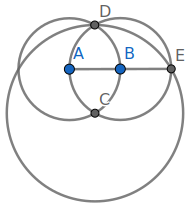
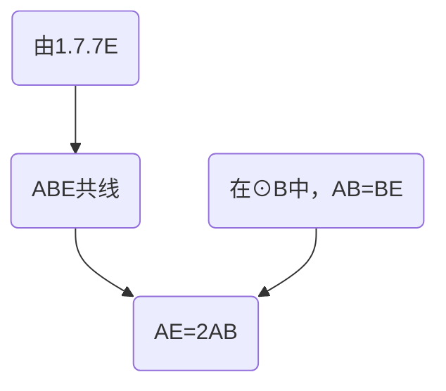
# 4.2.3L
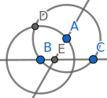
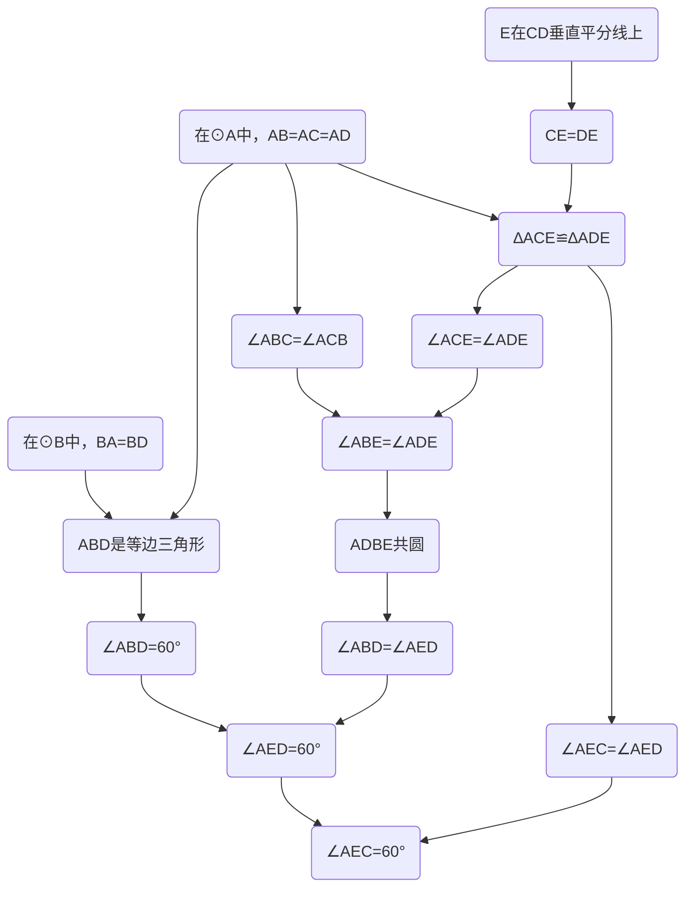
# 4.2.4E
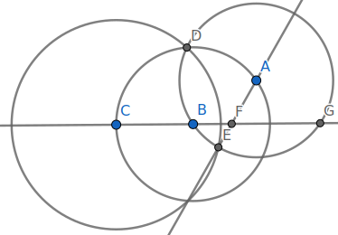
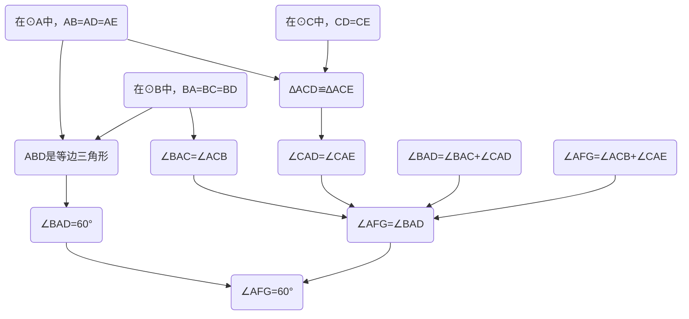
# 4.3.5L
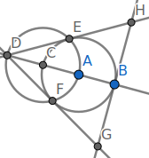
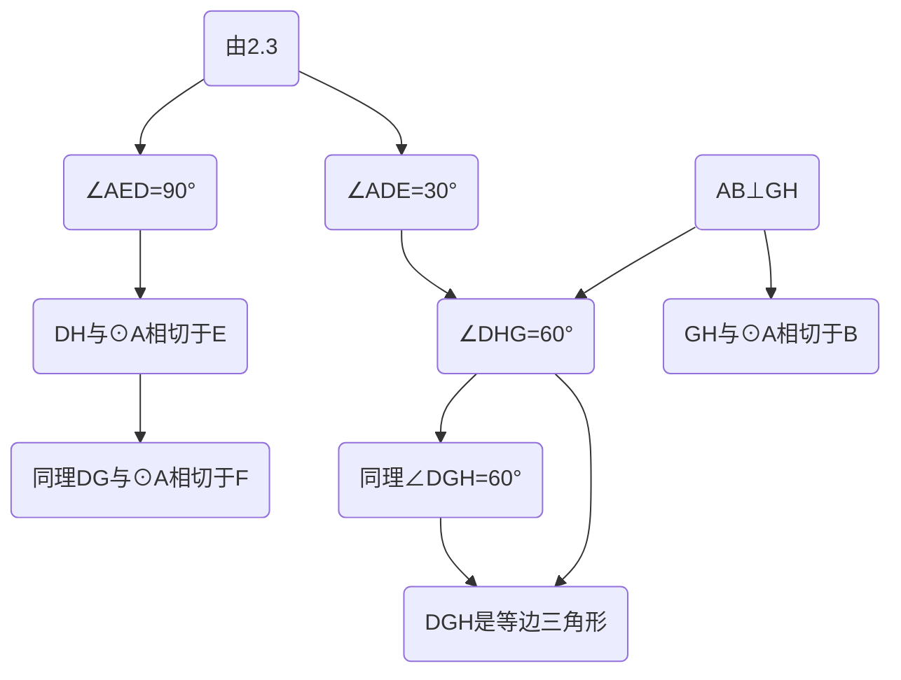
# 4.3.6E
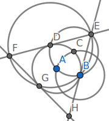
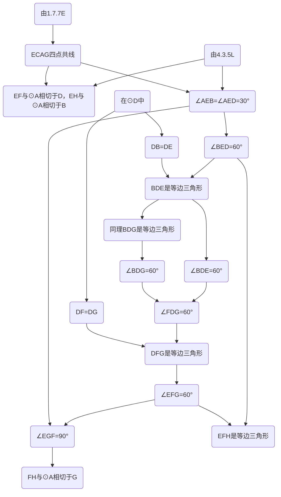
# 4.4.5L
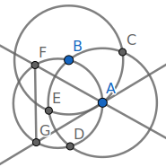
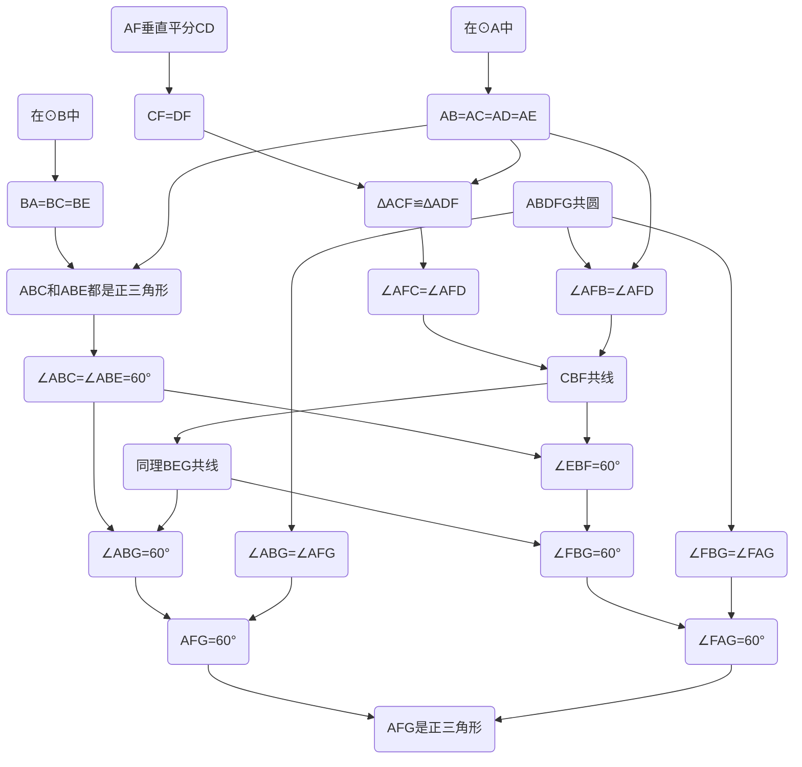
# 4.4.6E
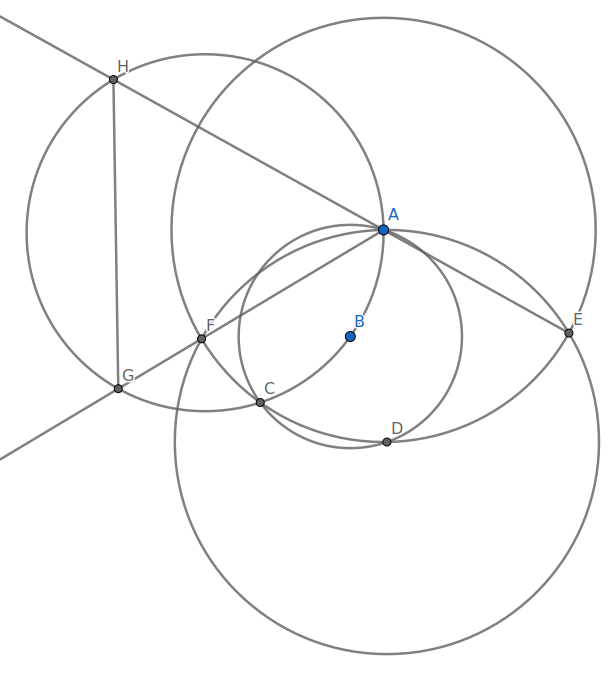
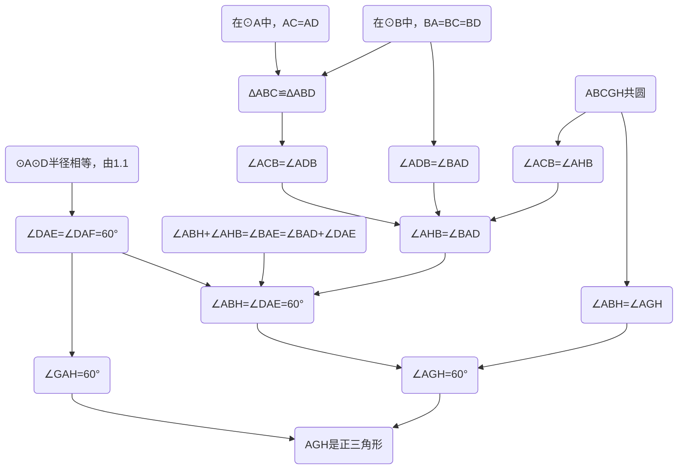
# 4.5


对角线交点是矩形的旋转对称中心，过对称中心的直线显然平分旋转对称图形。
# 4.6
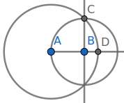
$$
\begin{align*}
&在⊙B中，BA=BC\\
&∵AB⊥BC\\
&∴AC=\sqrt{2}AB\\
&在⊙A中，AC=AD\\
&∴AD=\sqrt{2}AB
\end{align*}
$$
# 4.7
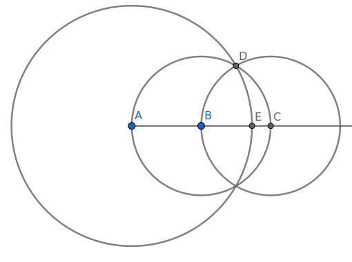
$$
\begin{align*}
&∵⊙B⊙C半径相等\\
&∴AB=BC=CD\\
&∵AC是⊙B直径\\
&∴∠ADC=90°\\
&∴AD=\sqrt{3}AB\\
&在⊙A中，AD=AE\\
&∴AE=\sqrt{3}AB
\end{align*}
$$
# 4.8.3L
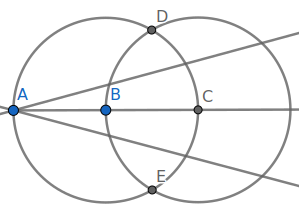
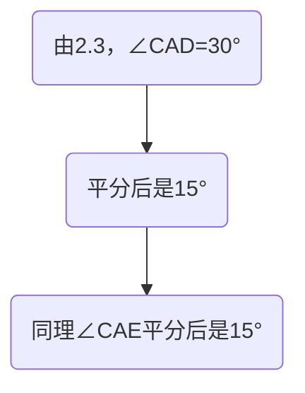
# 4.8.5E
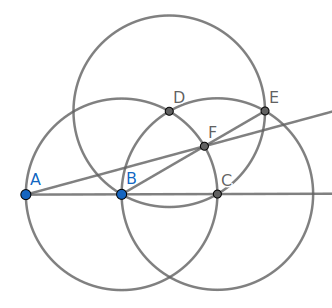
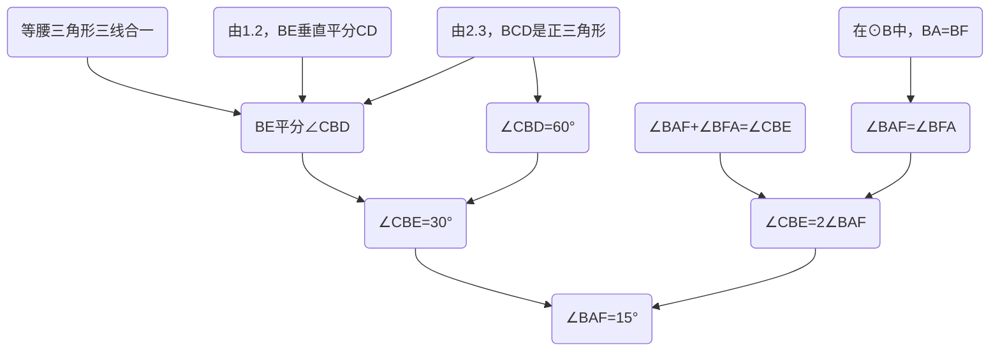
# 4.9.6L
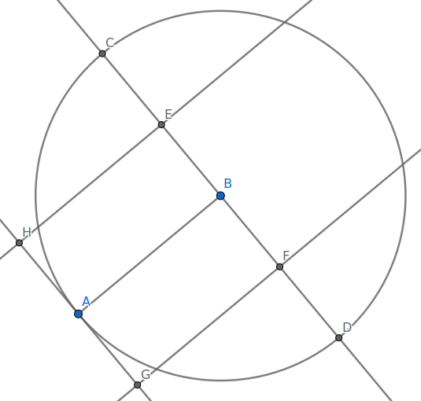
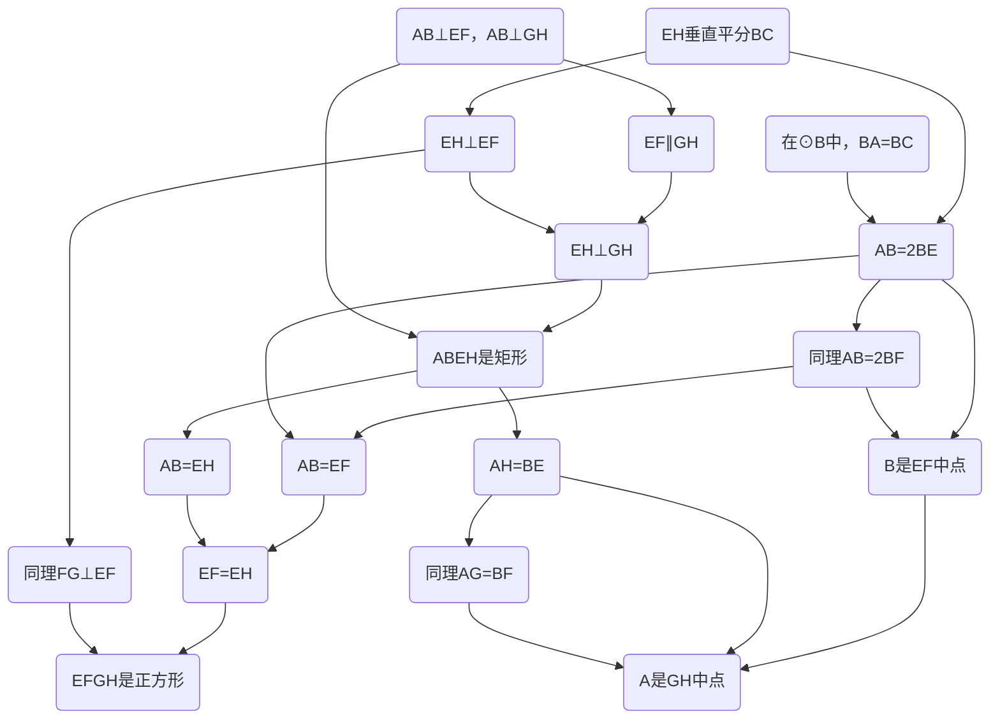
# 4.9.10E
作射线DE与射线GB交于O，射线GH与射线DF交于P，射线EG与射线FH交于Q，连接AE交DP于R，射线HF交射线DE于S
```mermaid
graph TB;
A6("在⊙A中")-->C6("AC=AG")
C6-->A8("∠DCG=∠AGP")
A2-->A9("∠DBG=∠DCG")
A8-->B0("∠AGP=∠DBG")
A9-->B0
B0-->B3
B1("∠AGO+∠OGP=∠AGP")
B2("∠OGP+∠P=∠DBG")-->B3("∠AGO=∠P")
B1-->B3
A2("BCGDE共圆")-->A3("∠ODP=∠OGP")
A0("在⊙B中")-->C5("BC=BE")
C5-->A3
A3-->A4("∆BDO∼∆BGP")
A4-->A5("∠DOG=∠P")
B3-->B4
A5-->B4("∠AGO=∠DOG")
A0-->C9("BF=BH")
C8-->D0("BE垂直平分FH")
D4-->D5
C9-->D0
D0-->D1("∠BES+∠DSQ=90°")
D1-->D5("∠BEC=∠DSQ")
A2-->D6("∠BEC=∠EGO")
D5-->D7("∠DSQ=∠EGO")
D2("CD是⊙A直径")-->D3("CE⊥DS")
D3-->D4("∠BEC+∠BES=90°")
C5-->D6
D6-->D7
B5-->C8("EF=EH")
C8-->B9
B8("AEFH共圆")-->B9("∠EAF=∠EFQ")
A1("⊙A⊙B半径相等")-->A7("AE=AG=BE=BF")
B5("在⊙E中")-->C7("EF=EG")
A7-->B6
C7-->B6("∆AEG≌∆BEF")
B6-->B7("∠AEQ=∠DFE")
C0("∠AEF+∠DFE=∠ARP")
B7-->C2
C1("∠AEF+∠AEQ=∠FEQ")-->C2("∠ARP=∠FEQ")
C0-->C2
B9-->C3("∆AFR∼∆FQE")
C2-->C3
C3-->C4("∠AFD=∠Q")
D8("")
```